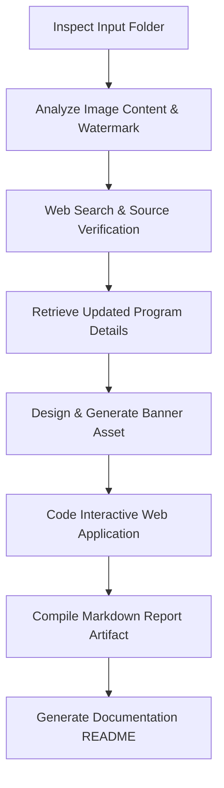

# 🩺 Medical School Admissions Explorer — Developer Guide & Process Documentation

This repository contains an interactive admissions tool and research report compiling undergraduate medical entry requirements for 24 universities across Australia and New Zealand for the **2026/2027 admissions cycle**.

---

## 🚀 How to Run the Project

### 1. Interactive Admissions Explorer Web Page
The main interface is a zero-dependency, single-page application (SPA) built using vanilla HTML5, CSS3, and JavaScript, fully optimized for both desktop and iPhone screen viewports.
* **Location:** [medicine_explorer.html](file:///C:/Users/sccm/gemini/webpage_fromPrompt/medicine_explorer.html)
* **Mobile-First/iPhone Friendly Enhancements:**
  - **Collapsible Bottom-Sheet Filters:** On mobile view, the heavy sidebar collapses into a floating action button showing the count of active filters. Tapping it slides up a clean filters bottom sheet.
  - **iOS Safe Area Support:** All bottom buttons and panels use `env(safe-area-inset-bottom)` to ensure the iOS Home Indicator doesn't overlap interactive targets.
  - **Detail Bottom Sheets:** The university details panel slides up as a bottom sheet (incorporating iOS drag-handle design cues) rather than sliding in from the right.
* **Vercel Hosting Ready:**
  To host this tool live on Vercel:
  1. In a deployment folder, copy `medicine_explorer.html` and rename it to `index.html`.
  2. Copy the banner image `med_explorer_banner.jpg` into the same folder.
  3. Deploy using the Vercel CLI (`vercel` from the terminal) or push to a GitHub repository connected to Vercel.

### 2. Comprehensive Admissions Report
A structured Markdown report including the master university requirements table, UCAT dates, and program analysis is located in your configuration artifacts:
* **Location:** [medical_school_admissions_report.md](file:///C:/Users/sccm/.gemini/antigravity-cli/brain/214621c0-23a8-4a0b-b8bc-b38b800987bd/medical_school_admissions_report.md)

---

## 🛠️ The Discovery & Generation Process

This project was built from scratch using a systematic multi-step research and engineering process:



### Step 1: Initial Folder Inspection
We scanned the [medicine](file:///C:/Users/sccm/gemini/webpage_fromPrompt/medicine) directory and identified three binary image files:
1. `image (2).png` – Overview listing of 12 universities with minimum ATARs and closing dates.
2. `image (3).png` – Detail card showing entry schemes, requirements, and fees for UNSW.
3. `image (4).png` – Continuation overview listing of 12 more universities and key UCAT ANZ testing dates.

### Step 2: Information Tracing & Source Verification
* **Watermark Analysis:** The bottom right of the screenshots contained a watermark for `Oursteps.com.au` (新足迹), the largest Chinese-Australian community forum.
* **Initial Search:** We searched web indexes using specific text anchors from the images:
  * *Query:* `"University of New South Wales" "Bachelor of Medical Studies / Doctor of Medicine" "Minimum ATAR" 96 "Places" 198 "Cost" "$13,558"`
  * *Findings:* Traced the specific cost of **$13,558** (representing the 2026 Australian Government maximum student contribution band for Dentistry, Medicine, and Veterinary Science) and the **198** domestic places quota to the **Prep4MedDent Admissions Guide**.
* **Source Identification:** Verified that the cards were captured from the [Prep4MedDent comparison tool](https://www.prep4meddent.com/), which was uploaded by a forum participant onto `Oursteps.com.au`.

### Step 3: Deep Web Research & Data Enrichment
To ensure the database was complete, current, and robust, we conducted targeted web searches on specific programs:
1. **UCAT ANZ 2026 Timelines:** Verified that the booking deadline concluded on **15 May 2026** and the active testing window runs from **1 July to 5 August 2026** (currently active).
2. **University of Sydney DDMP:** Confirmed that USyd does *not* require the UCAT for its Double Degree Medicine Program, but relies on a 99.95 ATAR threshold, a written assessment, and a group interview day.
3. **Griffith & UniSC Pathways:** Confirmed that the Bachelor of Medical Science provisional entry pathways bypass the GAMSAT and standard interviews, relying on a 99.80 unadjusted selection rank with UCAT acting as a tie-breaker.
4. **New Zealand Pathways:** Researched Auckland and Otago's specific structures, including Auckland's NCEA Rank Score (250-280) and Otago's HSFY (Health Sciences First Year) selection.
5. **Cross-Border, Multi-State & International Pathways:**
   * *University of Notre Dame Australia:* Offers its Doctor of Medicine (MD) and undergraduate assured pathways on campuses in both Fremantle (WA) and Sydney (NSW).
   * *Flinders University:* Delivers its South Australia-based MD program entirely in the Northern Territory (Darwin/regional NT) in partnership with Charles Darwin University via the Northern Territory Medical Program (NTMP).
   * *University of Queensland:* Offers the UQ-Ochsner medical program, an international pathway where students do their first 2 years in Brisbane (QLD) and their final 2 years in New Orleans, Louisiana (USA).

### Step 4: Asset Generation
* To elevate the project's visual design, we used an AI image generation model with a prompt targeting a high-end, dark-mode medical school banner featuring glowing neon purple and teal DNA helixes and stethoscope outlines.
* The asset was saved as `med_explorer_banner.jpg` and copied to the workspace root for HTML embedding.

### Step 5: Application Development & Aesthetics
The web explorer was designed using **premium styling guidelines**:
* **Color System:** Utilized HSL colors to create a responsive twilight-dark theme (`hsl(222, 28%, 7%)`) paired with high-contrast glowing borders and custom success/warning badge states.
* **Typography:** Embedded Google Fonts (`Outfit` for high-end headings and `Inter` for clean body typography).
* **Interactivity:**
  * Implemented real-time Javascript matching for text inputs, regional pills, UCAT dropdowns, and interview selectors.
  * Added a dynamic range input supporting ATAR thresholds from 80.00 to 100.00.
  * Designed a responsive slide-out **drawer overlay** that locks background scroll and displays detailed program prerequisites, application checklists, and direct official URLs.

---

## 📂 Project Structure

```bash
webpage_fromPrompt/
├── medicine/                       # Original screenshots folder
│   ├── image (2).png
│   ├── image (3).png
│   └── image (4).png
├── med_explorer_banner.jpg         # Generated visual banner asset
├── medicine_explorer.html          # Interactive explorer application
└── README.md                       # Process & developer guide (this file)
```

---

## 📑 Data Sources Summary
* **UCAT ANZ Consortium:** Official UCAT booking and testing timelines ([ucat.edu.au](https://www.ucat.edu.au/)).
* **Australian Government StudyAssist:** Commonwealth Supported Place (CSP) Student Contribution band definitions ([studyassist.gov.au](https://www.studyassist.gov.au/)).
* **Prep4MedDent Admissions Directory:** Base structures for university requirements ([prep4meddent.com](https://www.prep4meddent.com/)).
* **University Admission Centers:** QTAC, UAC, VTAC, SATAC, and TISC official portals.
